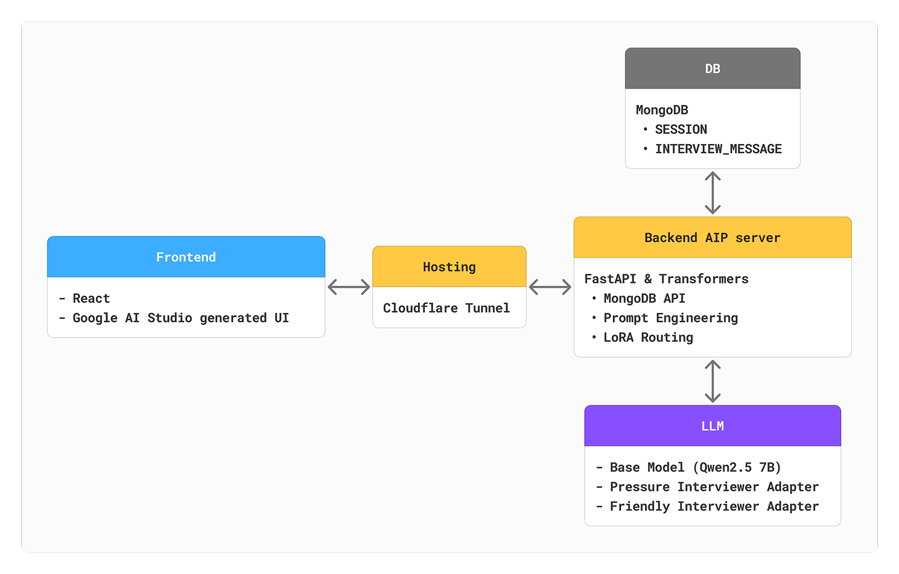
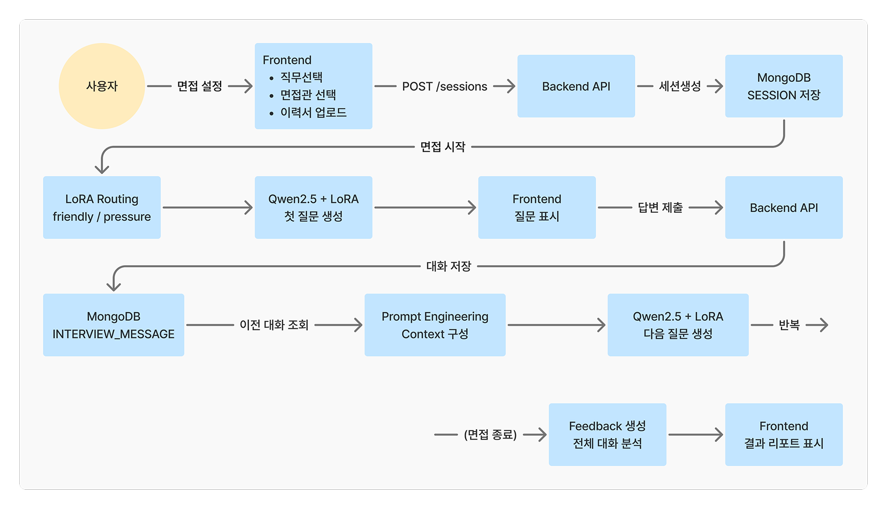
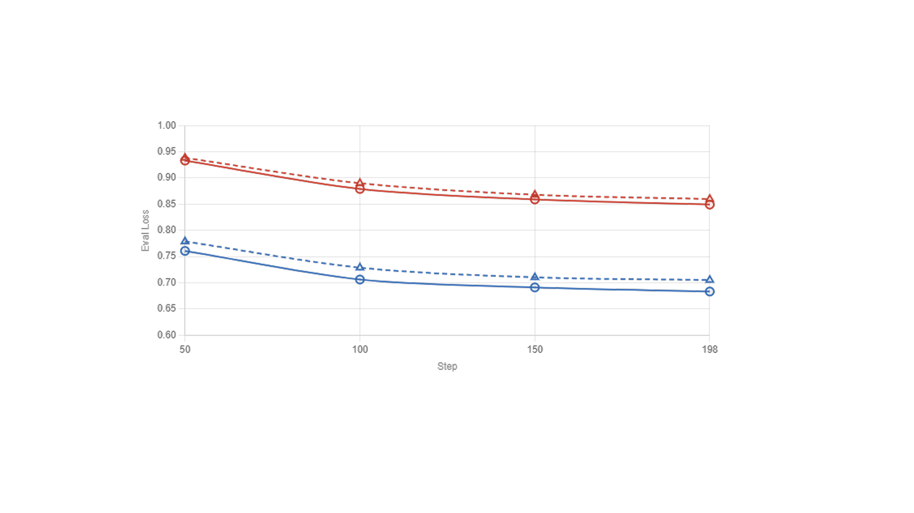
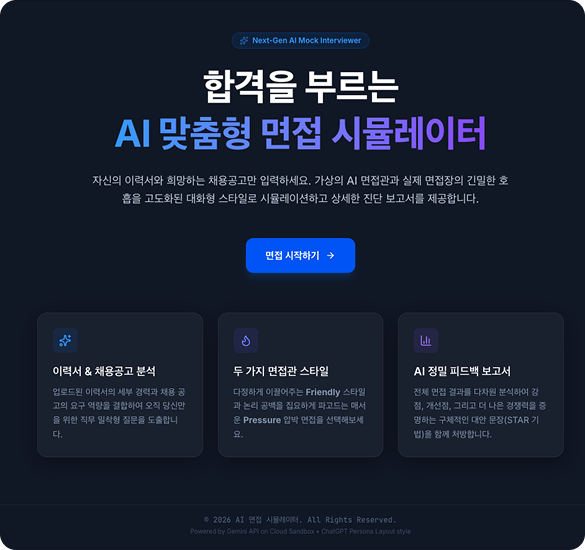
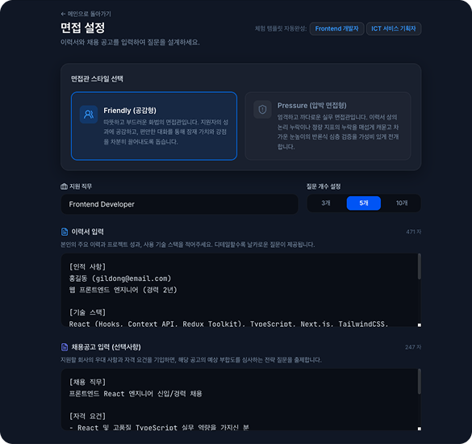
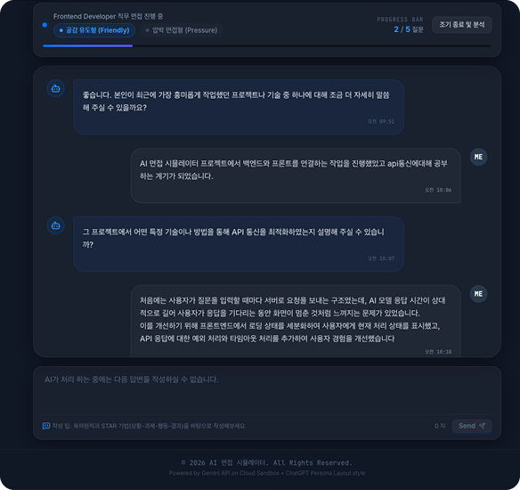

# 면접 경험이 부족한 취준생을 위한 AI 면접 시뮬레이터
## (Qwen2.5-7B QLoRA 파인튜닝)

ICT 직무 면접 시뮬레이터의 LLM 학습 및 평가 파이프라인입니다.

사용자의 이력서와 직무에 맞춰 '압박형'과 '친화형' 페르소나를 가진 AI 면접관과 모의 면접을 진행하고 피드백을 제공하는 서비스입니다.

파인튜닝을 통해 베이스 모델의 중국어 혼입 문제를 해결하고, 프롬프트 엔지니어링을 통해 응답 속도를 최대 7초에서 1~2초대로 단축했습니다.

> 팀 협업 및 개발 환경 설정은 [CONTRIBUTING.md](./CONTRIBUTING.md)를 참고하세요.

---

### 이 레포지토리에 대하여

본 레포지토리는 ESTCamp_DaonTeam의 AI 면접 시뮬레이터 Project를 기반으로, 데이터 파인튜닝 및 평가 파이프라인 부분을 정리한 포트폴리오입니다.

**담당 역할**
- 데이터 수집 및 파인튜닝
- prompt engineering 및 judge 모델 구현
- 데이터 전처리 및 평가 지표 설계

데이터 증강, LoRA 파인튜닝, 프롬프트 엔지니어링, 평가(LLM-as-a-Judge, Rule-based)에 이르는 각 단계별 스크립트를 작성하고 연계하여 모델 학습·평가 워크플로우를 수행하였다.

---

## 시스템 아키텍처



---

## 프로젝트 기간

| 구분 | 기간 | 활동 |
| :--- | :--- | :--- |
| 사전 기획 | 5/20(수) ~ 22(금) | 프로젝트 주제 확인 및 목표 설정, 기능 정의 |
| 파이프라인 구축 | 5/25(월) ~ 27(수) | 파이프라인 구축 |
| 데이터 수집 및 전처리 | 5/25(월) ~ 29(금) | 데이터 수집 및 학습 & 개선 |
| 파인튜닝 테스트 | 5/28(목) ~ 29(금) | LLM + LoRA 연결 & 테스트 |
| 백엔드 구축 | 6/1(월) ~ 5(금) | FastAPI & DB 연결 |
| 프론트엔드 구축 | 6/8(월) ~ 9(화) | 웹페이지 생성 & API 연결 |
| QA 및 통제실험 | 6/1(월) ~ 9(화) | 모델 성능 보완, 발표자료 준비 |
| 테스트 | 6/10(수) | 동작 테스트 및 점검 |
| 발표준비 | 6/11(목) ~ 12(금) | 발표자료 준비 |


---

## 제안 배경

- 많은 취준생들이 기술적 역량을 갖추었음에도 불구하고, 실전 면접의 압박감과 돌발 질문 대응에 어려움을 겪는다.<br>면접은 항상 존재하는 과제이지만 스터디를 통하지 않으면 경험하고 대비하기 어렵다.

- AI를 이용하여 면접에 대비하고자 하나, 기존 LLM은 면접관 특유의 꼬리질문 생성이나, 특정 직무에 특화된 페르소나를<br>유지하는 데 한계가 존재하며, 면접 환경을 제공하는 것 보다 피드백 위주에 초점을 맞춘다.

- 본 시뮬레이터는 사용자의 이력서와 직무에 맞춰 '압박형', '친화형' 페르소나를 구현하여<br>실제 면접장과 유사한 긴장감과 피드백을 제공하고자 한다.
  
---

주요 기능

- 페르소나 선택 : 논리 검증 위주의 압박 면접형 또는 긴장 완화 위주의 공감 유도형 면접관 선택 가능
- 이력서 기반 맞춤 질문 : 사용자가 업로드한 이력서와 채용 공고를 분석하여 개인화된 첫 질문 및 꼬리질문 생성
- LoRA 학습 : 파인튜닝을 통해 모델이 별도의 긴 지시문 없이도 면접관의 발화 패턴과 ICT 도메인 지식을 활용하도록 설계
- 실시간 스타일 전환 : 면접 진행 도중 사용자 니즈에 따라 면접관의 성향을 즉시 변경할 수 있는 유연한 로직 구현
- 최종 피드백 리포트 : 면접 종료 후 전체 대화 내용을 분석하여 강점, 개선점 및 STAR 기법 기반의 제안 포함


---



```text
파이프라인 구조
[면접 준비 단계]
사용자 정보 입력 (직무/이력서)
    └─▶ Backend API (FastAPI) 세션 생성
            └─▶ MongoDB 세션 및 대화 기록 저장 공간 확보

[실전 면접 단계]
사용자 답변 입력
    └─▶ Prompt Engineering (이전 대화 Context 구성)
            └─▶ LoRA Routing (Friendly / Pressure 어댑터 선택)
                    └─▶ Qwen2.5-7B + LoRA (맞춤형 꼬리질문 추론)
                            └─▶ Frontend 인터페이스 출력

[결과 분석 단계]
면접 종료 요청
    └─▶ 전체 대화 데이터 분석 (LLM Judge)
            └─▶ 피드백 리포트 생성 및 화면 표시
```

---

## LoRA 어댑터

허깅페이스에서 다운로드할 수 있습니다.

레포지토리 주소 : **[teems79/interview-lora](https://huggingface.co/teems79/interview-lora)**

| 어댑터 | 설명 |
|--------|------|
| `qwen2.5/pressure` | Qwen2.5-7B-Instruct 압박 면접관 LoRA |
| `qwen2.5/friendly` | Qwen2.5-7B-Instruct 친화 면접관 LoRA |
| `qwen3.5/pressure` | Qwen3.5-9B 압박 면접관 LoRA |
| `qwen3.5/friendly` | Qwen3.5-9B 친화 면접관 LoRA |

---

## 실행 환경

| 구분 | 환경 | 용도 |
|------|------|------|
| 학습 / 추론 | A100 40GB (SSH, MIG 3g.40gb) | LoRA 학습, 하이퍼파라미터 탐색, 추론 |
| 평가 / 분석 | Google Colab (L4 GPU) | A/B 테스트, 프롬프트 엔지니어링, LLM-as-a-Judge, 시각화 |

> SSH 환경은 GPU 공유로 인한 OOM 발생 가능성이 있어, 평가 및 분석 작업은 Colab에서 진행하였습니다.

---

## 프로젝트 구조

```
daon_ai_train/
│
├── src/                             # 핵심 학습 및 평가 코드
│   ├── train_lora.py                # LoRA 파인튜닝 (Pressure / Friendly 순차 학습)
│   ├── hyperparameter_search.py     # Optuna TPE 하이퍼파라미터 탐색
│   ├── inference.py                 # Qwen2.5-7B 추론 (Multi-LoRA 스와핑)
│   ├── inference_9B.py              # Qwen3.5-9B 추론
│   ├── inference_cpu.py             # CPU 환경 추론
│   ├── convert_to_gguf.py           # GGUF 변환
│   ├── prompt_engineering.ipynb     # 프롬프트 엔지니어링 v1~v12 [Colab]
│   ├── AB_Test.ipynb                # A/B 강약 프롬프트 테스트 [Colab]
│   ├── AB_Test_evaluation.ipynb     # Rule Pass Rate / Style Score 평가 [Colab]
│   ├── llm_as_a_judge.ipynb         # LLM-as-a-Judge Pairwise Win Rate 분석 [Colab]
│   └── four_quadrants.ipynb         # 4사분면 모델 성능 시각화 [Colab]
│
├── scripts/                         # 데이터 전처리 및 증강
│   ├── augment_persona.py           # GPT 기반 페르소나 데이터 증강
│   ├── extract_neutral_followups.py # 중립 꼬리질문 추출
│   └── run_style_qa.py              # 스타일 QA 자동 평가 파이프라인
│
├── evaluators/
│   └── style_rules.py               # Pressure / Friendly 룰 기반 평가 기준 정의
│
├── experiments/                     # 하이퍼파라미터 탐색 및 프롬프트 실험 결과
│   ├── hyperparam_results.csv       # Optuna 탐색 결과
│   ├── prompt_scores.csv            # 프롬프트 버전별 평가 점수
│   ├── prompt_evolution_summary.txt # 프롬프트 개선 이력 요약
│   ├── qwen2.5_hyperparameter.txt   # Qwen2.5 최적 하이퍼파라미터
│   └── qwen3.5_hyperparameter.txt   # Qwen3.5 최적 하이퍼파라미터
│
├── prompts/                         # 프롬프트 버전 관리
│   ├── final_pressure.txt           # 최종 압박 페르소나 프롬프트
│   ├── final_friendly.txt           # 최종 친화 페르소나 프롬프트
│   ├── prompt_versions_pressure.txt # 압박 페르소나 프롬프트 변경 이력
│   ├── prompt_versions_friendly.txt # 친화 페르소나 프롬프트 변경 이력
│   ├── prompt_baseline_summary.txt  # 프롬프트 엔지니어링 baseline 총정리
│   └── prompt_changelog.txt         # 프롬프트 엔지니어링 변경점 총정리
│
├── data/
│   ├── processed/                   # 전처리 및 증강 완료 데이터
│   ├── raw/                         # 원본 데이터
│   ├── samples/                     # 샘플 데이터
│   └── splits/                      # train / val / test split
│
├── training/                        # 학습 설정 및 Unsloth 관련
│   ├── configs/
│   └── unsloth/
│
├── embedding.py                     # OpenAI 임베딩 + 클러스터링 기반 데이터 분할
├── requirements.txt
├── CONTRIBUTING.md                  # 개발 환경 및 협업 규칙
└── README.md
```

---


## 파이프라인

### 1. 데이터 증강

```bash
python scripts/augment_persona.py
```

GPT-4o-mini를 활용하여 ICT 직무 면접 질문에 대한 지원자 답변 및 페르소나별 꼬리질문을 ThreadPoolExecutor 기반 병렬 처리로 생성합니다.<br>
Pressure / Friendly 페르소나 각각에 대해 vague, logical, experience_based 등 6가지 답변 유형을 생성합니다.

### 2. 데이터 분할

```bash
python embedding.py
```

OpenAI 임베딩 + AgglomerativeClustering + GroupShuffleSplit을 사용하여
의미적으로 유사한 데이터가 동일 split에 집중되지 않도록 분할합니다.

### 3. LoRA 학습



```bash
python src/train_lora.py
```

Unsloth QLoRA를 사용하여 Pressure / Friendly 페르소나 어댑터를 순차 학습합니다.

| 모델 | LoRA Rank | Learning Rate | Trainable Params |
|------|-----------|---------------|-----------------|
| Qwen2.5-7B-Instruct | 32 | 1e-4 | 80.7M (1.05%) |
| Qwen3.5-9B | 8 | 2e-4 | 14.5M (0.15%) |

- Optimizer: AdamW (cosine scheduler)
- Effective Batch Size: 16 (batch 4 × gradient accumulation 4)
- Early Stopping: patience=3 (eval_loss 기준)

### 4. 하이퍼파라미터 탐색

```bash
python src/hyperparameter_search.py
```

Optuna TPE 탐색으로 LoRA rank, learning rate, batch size 최적값을 탐색합니다.
탐색 결과는 `experiments/` 디렉토리에 저장됩니다.

### 5. 추론

```bash
# Qwen2.5-7B (Multi-LoRA 스와핑)
python src/inference.py

# Qwen3.5-9B
python src/inference_9B.py
```

### 6. 스타일 QA 평가

```bash
python scripts/run_style_qa.py
```

룰 기반 검증기(Style Rules)를 통해 모델 출력의 규칙 준수율을 자동 평가합니다.

---

## 평가 지표

| 지표 | 설명 |
|------|------|
| Style Score | Pressure / Friendly 룰 준수 종합 점수 |
| Rule Pass Rate | sentence / question / forbidden / end / korean 규칙별 통과율 |
| Win Rate | LLM-as-a-Judge Pairwise 양방향 평가 승률 (position bias 보정) |
| Hard Fail Rate | 중국어 혼입 / 프롬프트 유출 / 한국어 비율 미달 발생률 |
| Reference Similarity | 모델 출력과 reference output 간 코사인 유사도 |

---

## 주요 결과

### LLM-as-a-Judge Pairwise (표현 품질)
GPT-5 양방향 평가 (position bias 보정)

| 순위 | 모델 | Win Rate |
|------|------|----------|
| 1 | Qwen3.5-9B-LoRA | 81.09% |
| 2 | Qwen2.5-7B-Base | 48.40% |
| 3 | Qwen2.5-7B-LoRA | 37.50% |
| 4 | Qwen3.5-9B-Base | 33.01% |

### Rule Pass Rate (형식 준수율)
시스템이 요구하는 출력 규칙 준수 여부 측정

| 모델 | Style Score | sentence | question | end | korean |
|------|------------|----------|----------|-----|--------|
| Qwen3.5-9B-LoRA | 83.77% | 100% | 84.21% | 52.64% | 53.38% |
| Qwen2.5-7B-LoRA | 66.82% | 98.87% | 73.31% | 18.42% | 78.38% |
| Qwen2.5-7B-Base | 61.68% | 96.99% | 71.43% | 20.11% | 94.74% |
| Qwen3.5-9B-Base | 54.92% | 92.30% | 63.72% | 22.56% | 44.74% |

> Win Rate는 출력의 자연스러움과 표현 품질을,<br> Rule Pass Rate는 시스템이 요구하는 출력 형식 준수 여부를 측정하며 두 지표는 상호 보완적으로 해석해야 합니다.
> 
---

## 배포 화면

| 메인 화면 | 면접 진행 | 피드백 리포트 |
|---|---|---|
|  |  |  |

---

## 의존성 설치

```bash
pip install -r requirements.txt
```

---

### 회고


## 프로젝트 회고

### 어려웠던 점

1. 모델별 출력 불안정 문제 (LoRA / Base 간 차이)
- Qwen 2.5-7B 및 9B 계열 LoRA 모델에서 중국어 혼입, STAR 구조 과다 생성 등 출력 안정성 문제가 발생하였다.<br>
  특히 동일 프롬프트를 사용했음에도 모델 크기 및 어댑터에 따라 출력 품질 편차가 크게 나타났다.

2. 평가 지표 간 불일치 문제
- 일부 모델에서 한국어 비율이 높게 측정되었음에도 불구하고, 실제 샘플에서는 중국어 혼입이 3~7% 수준으로 관측되는 등<br>
  rule-based metric과 실제 qualitative 결과 간 불일치가 발생하였다.

3. LLM-as-a-Judge Pairwise 평가 편향 문제
- GPT 기반 평가에서 A/B 위치에 따라 선택 비율이 61.8% vs 38.2%로 치우치는 position bias가 발생하였다.<br>
  이는 동일 답변이라도 순서에 따라 결과가 달라지는 구조적 문제를 의미하였다.

4. LoRA 모델에서의 빈 출력 (NaN 처리)
- 일부 LoRA 조합에서 추론 결과가 빈 문자열로 반환되어 NaN으로 처리되는 현상이 발생하였다.<br>
  해당 문제는 base 모델에서는 발생하지 않았다.


### 해결 방법

1. 프롬프트 및 LoRA 반복 개선
- 프롬프트를 v1 ~ v12까지 반복 개선하며 출력 안정성을 개선하였다.<br>
  중국어 혼입 문제는 LoRA fine-tuning을 통해 chinese_rate 3~7%에서 0%대로 감소시켰다.<br>
  다만 모델 크기(7B / 9B)에 따른 최적 프롬프트 차이는 충분히 반영되지 못한 한계가 존재하였다.

2. 평가 지표 계산 로직 수정
- 한국어 비율 계산 시 일본어 / 중국어 / 영어가 분모에서 제외되는 문제를 발견하고,<br>
  모든 언어를 포함하도록 metric 정의를 수정하여 지표 왜곡을 해결하였다.

3. Pairwise 평가 bias 보정
- 모든 모델 쌍에 대해 A/B 순서를 교차한 양방향 평가(총 624회)를 수행하고 결과를 평균하여<br>
  position bias를 보정하였다. (A/B 선택 비율 61.8:38.2 → 51.6:48.4로 개선)

4. LoRA NaN 문제 분석 및 처리
- tokenizer 및 입력 길이 분석을 통해 입력 구조 문제 가능성을 배제하였다.<br>
  base 모델에서는 문제가 발생하지 않는 점을 고려하여 LoRA 특성 또는 decoding 과정 문제로 추정하였다.

  다만 추론 로그 부족으로 인해 원인을 확정하지 못했으며,<br>
  해당 샘플은 제외하고 NaN 제외 기준 Effective Pass Rate를 별도로 산출하였다.


### 개선 방향

1. 모델별 독립 최적화 필요
- 현재는 프롬프트 및 LoRA 설정이 모델 간 동일하게 적용되어 있으며,<br>
  향후 모델 크기별 (7B / 9B) 독립 최적화가 필요하다.

2. NaN 발생 원인 추적 강화
- generated_ids 및 decoding 로그 저장이 없어 원인 분석에 한계가 있었다.<br>
  향후 inference 단계에서 로그 기반 디버깅 체계를 구축할 필요가 있다.

3. LLM-as-a-Judge 개선
- candidate answer context를 충분히 반영하지 못한 구조로 인해<br>
  평가 정확도 및 일관성 개선 여지가 존재한다.

4. decoding 안정성 개선
-  min_new_tokens, eos behavior 제어 등 decoding 안정화 전략 적용이 필요하다.

> 프로젝트를 통해 LLM 기반 생성 모델의 평가 불안정성과 bias 문제를 실험적으로 확인하고,<br>
> 이를 데이터/프롬프트/평가 구조 개선을 통해 단계적으로 해결하는 경험을 쌓았다.
